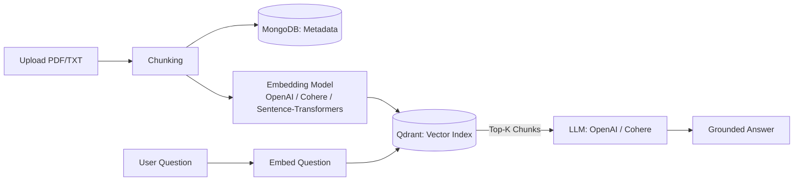

# AI Teaching Assistant — RAG Backend


A Retrieval-Augmented Generation (RAG) backend that turns uploaded documents into a searchable knowledge base and answers questions with context-aware, LLM-generated responses — in English and Arabic.

## Table of Contents
- [Overview](#overview)
- [Architecture](#architecture)
- [Features](#features)
- [Tech Stack](#tech-stack)
- [Getting Started](#getting-started)
- [API Reference](#api-reference)
- [Basic Workflow](#basic-workflow)
- [Roadmap](#roadmap)
- [License](#license)

## Overview

Users upload documents (PDF/TXT) into a project, the system chunks and embeds them, and stores the vectors in Qdrant for fast semantic search. When a user asks a question, the most relevant chunks are retrieved and passed to an LLM to generate a grounded answer.

## Architecture



## Features

- Project-based data management — separate knowledge bases per project
- File upload support for `.txt` and `.pdf`
- Pluggable backends — swap LLM provider (OpenAI, Cohere) and embedding model (OpenAI, Cohere, local Sentence-Transformers) via config
- RESTful API covering the full ingest → index → query pipeline
- English and Arabic prompt templates
- Dockerized MongoDB for easy local setup

## Tech Stack

| Layer | Technology |
|---|---|
| Backend | Python 3.8+, FastAPI |
| Vector DB | Qdrant |
| Metadata DB | MongoDB |
| LLM / Embeddings | LangChain, OpenAI SDK, Cohere, Sentence-Transformers |
| Infra | Docker, Docker Compose |

## Getting Started

### Prerequisites

- Python 3.8+
- Docker and Docker Compose

### 1. Start MongoDB

```bash
cd docker
cp .env.example .env   # set MONGO_INITDB_ROOT_USERNAME / PASSWORD
docker compose up -d
cd ..
```

### 2. Set up the app

```bash
cd src
python3 -m venv venv && source venv/bin/activate
pip install -r requirements.txt
cp .env.example .env   # fill in MONGODB_URL, OPENAI_API_KEY, etc.
```

### 3. Run

```bash
uvicorn main:app --reload --host 0.0.0.0 --port 5000
```

## API Reference

| Method | Endpoint | Description |
|---|---|---|
| GET | `/api/v1/` | Health check / app info |
| POST | `/api/v1/data/upload/{project_id}` | Upload a document |
| POST | `/api/v1/data/process/{project_id}` | Chunk uploaded documents |
| POST | `/api/v1/nlp/index/push/{project_id}` | Embed and index chunks in Qdrant |
| GET | `/api/v1/nlp/index/info/{project_id}` | Vector collection stats |
| POST | `/api/v1/nlp/index/search/{project_id}` | Semantic search over indexed chunks |
| POST | `/api/v1/nlp/index/answer/{project_id}` | Ask a question, get a RAG-generated answer |

## Basic Workflow

1. Upload a document to a project
2. Process and chunk it
3. Push embeddings to the vector index
4. Ask a question and get a grounded answer

## Roadmap

- [ ] Lightweight frontend / chat UI
- [ ] Automated test suite
- [ ] Caching layer for repeated queries
- [ ] Hosted live demo

## License

MIT — see [LICENSE](LICENSE).
